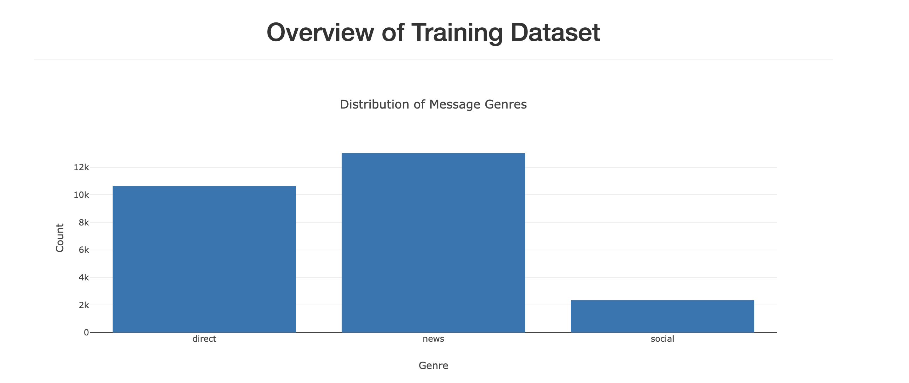
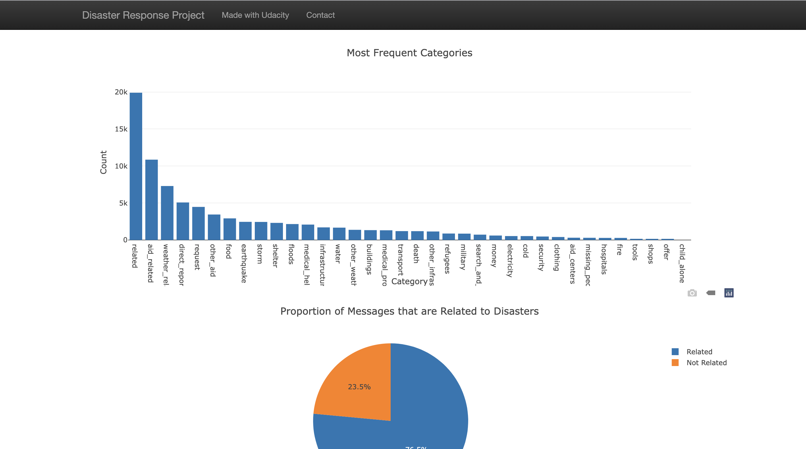
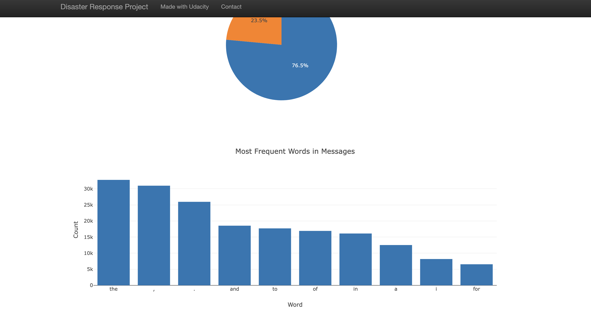

# Disaster Response Pipeline Project


## Summary
This project aims to build a machine learning pipeline to categorize emergency messages based on the needs communicated by the sender. During natural disasters, organizations receive millions of emergency messages, and it's not feasible to read through each one manually. This pipeline categorizes these messages to ensure they are sent to the appropriate disaster relief agency, thereby facilitating quicker and more effective responses. The project includes an ETL Pipeline to clean the data, a Machine Learning Pipeline to build a message classification model, and a web application to showcase these real-world applications.

## Instructions

### Setting up environment:
Install these requirements using the same version of Python, 3.10.9:

```
pip install -r requirements.txt
```


### Setting up Database and Model
1. Navigate to the project's root directory and run the following commands to set up the database and machine learning model:

    - To execute the ETL pipeline that cleans and stores the data in a SQLite database:
    ```
    python data/process_data.py data/disaster_messages.csv data/disaster_categories.csv data/disaster.db
    ```
    - To run the machine learning pipeline that trains the classifier and saves the model:
    ```
    python models/train_classifier.py data/disaster.db models/classifier.pkl
    ```

### Running the Web App
1. Navigate to the app's directory and run the following command to start the web application:
    ```
    python run.py
    ```

2. Access the web application by visiting:
    ```
    http://0.0.0.0:3001/
    ```

## Repository File Structure

- Root Directory
    - data
        - disaster_messages.csv
        - disaster_categories.csv
        - process_data.py
    - models
        - train_classifier.py
    - app
        - run.py
        - templates
            - Various HTML files (e.g., `index.html`, `go.html`)
    - README.md

## Explanation of File Structure

- **Root Directory**: The main folder containing all the project files and subfolders.
    - **data**: Contains raw data files and ETL script.
        - `disaster_messages.csv`: Input file containing emergency messages from various sources.
        - `disaster_categories.csv`: Contains categories that correspond to the messages.
        - `process_data.py`: Script responsible for the ETL pipeline.
    - **models**: Contains machine learning pipeline script and saved model.
        - `train_classifier.py`: Script that trains a classifier on the cleaned data.
    - **app**: Contains web application scripts and templates.
        - `run.py`: Script to launch the web application.
        - `src.py`: Additional script to support model function
        - **templates**: Folder containing HTML templates.
            - Various HTML files (e.g., `index.html`, `go.html`): HTML templates for the web application.
    - `README.md`: This file, explaining the project and its structure.


## Screenshots

- Picture 2


- Picture 3


Feel free to contact for any more clarification or details.
